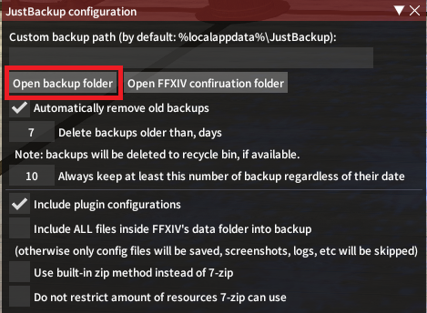
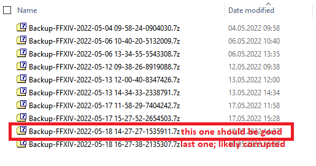
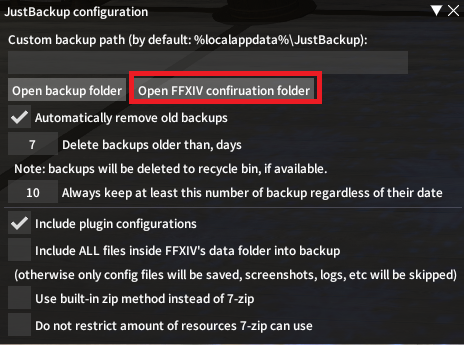
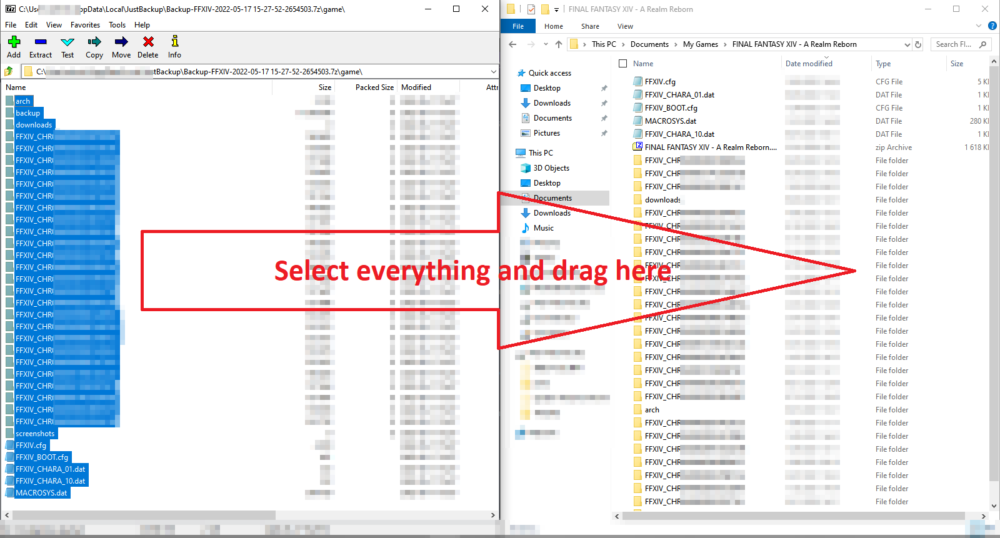

# JustBackup
Dalamud plugin that automatically creates backup of your game and plugins configuration upon game starting.

## Restoring a backup
In the event something gone wrong, you can restore backup manually. Plugin can not restore your settings automatically because in most cases you need to have game closed while restoring.

Before you start:
1. Make sure you have closed the game before starting to restore any configuration files (there are exceptions to this step, read further)
2. Make sure you have suitable program to open 7-zip archives. You may download free 7-zip program to do so from it's official website: https://www.7-zip.org/

## Locating needed backup
By default backups are located in `%localappdata%\JustBackup`. You can also open backup folder from the plugin itself using "Open backup folder" button:

Inside that folder you will find number of recent backups. Most recent one will likely contain corrupted configuration; you will want to use previous one or go back few backups, depending how much times you have started the game after your configuration got corrupted.

Now just open it up and proceed to restoring files.

## Locating game configuration folder
Your game confguration is usually located in `%userprofile%\Documents\My Games\FINAL FANTASY XIV - A Realm Reborn` folder. You can as well use corresponding button inside JustBackup's configuration to open it up.

## Restoring whole game configuration at once
To do so, simply go into `game` folder inside backup archive, select everything and drag files into `FINAL FANTASY XIV - A Realm Reborn`, and confirm all requests to overwrite existing files. After that your game configuration will be restored to previous state.

